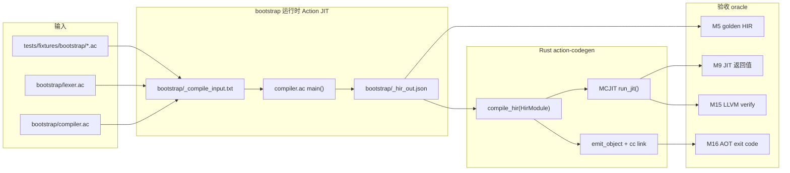

# Bootstrap（M4–M141 Path B 前端）

Action-in-Action 编译器前端试点目录。首版仅使用 `doc/bootstrap-subset.md` 允许的语言特性。

`lexer.ac` 与 `compiler.ac` 通过 `import prelude` 引用 `bootstrap/prelude.ac`（M24）；`keywordKindOpsTail` 由宿主定义（lexer：`not`→`!`；compiler：`not`→`not`）。

## 目标

| 里程碑 | 内容 | 状态 |
|--------|------|------|
| M4 | `lexer.ac` token 输出与 Rust lexer golden 一致 | ✅ keywords / literals / operators / ranges / **bootstrap_keywords** |
| M5 | `compiler.ac` 解析 bootstrap 子集 → HIR JSON | ✅ **33** fixture golden + 大文件 smoke |
| M6 | Action 前端扫描/解析自身源码 | ✅ lexer alpha（>800 tokens）；**compiler alpha**（≥196 fun + compile_hir verify） |
| M7 | Bootstrap HIR → Rust `compile_hir` | ✅ **33** 夹具 + 大文件 smoke；LLVM verify 子进程（表驱动，跳过 `infinite_for`） |
| M8 | Bootstrap vs Rust 前端 oracle | ✅ 函数名 + HIR 结构关键字 |
| M9 | Bootstrap HIR → MCJIT 执行 | ✅ 返回值 oracle + **logical_ops** / **map_keys** / map/set 迭代 JIT |
| M10 | 用户项 HIR 形状 oracle | ✅ **全部 33** main 夹具 ty/span stripped 与 Rust 一致 |
| M11 | Bootstrap compiler JIT 自举执行 | ✅ `compiler.ac` HIR → MCJIT → `enum_simple.ac`；输出 HIR 函数名与 Rust 前端一致 |
| M12 | Bootstrap compiler JIT 解析 `lexer.ac` | ✅ MCJIT → `main` 返回 0；输出 HIR 函数名与 Rust 前端一致 |
| M13 | Bootstrap compiler JIT 解析 `compiler.ac` | ✅ 运行时自举闭环：JIT 解析自身；输出 HIR 函数名与 Rust 前端一致 |
| M14 | Bootstrap lexer JIT tokenize | ✅ `lexer.ac` HIR → MCJIT → M4 四类 golden kinds（codegen 链接 runtime bitcode 后同步 `__action_str`） |
| M15 | 大文件 LLVM verify + path B stdout 闭环 | ✅ `lexer.ac`/`compiler.ac` verify；`tokenize_keywords` JIT stdout = M4 keywords |
| M16 | Bootstrap HIR → AOT 执行 | ✅ `jit_smoke` 返回 42；`compiler.ac` AOT 解析 `enum_simple.ac`（对齐 M11）；输出 HIR 函数名与 Rust 前端一致 |
| M17 | Bootstrap compiler AOT 自解析 | ✅ `compiler.ac` HIR → AOT → 解析自身（对齐 M13）；输出 HIR 函数名与 Rust 前端一致 |
| M18 | Bootstrap compiler AOT 解析 `lexer.ac` | ✅ AOT → `main` 返回 0（对齐 M12）；输出 HIR 函数名与 Rust 前端一致 |
| M19 | Bootstrap lexer AOT tokenize | ✅ `lexer.ac` HIR → AOT → M4 四类 golden kinds（对齐 M14 JIT） |
| TC1 | 禁止夹具 typecheck | ✅ `bad_return.ac` 由 Rust 前端拒绝 |
| TC2 | Bootstrap return Int↔Bool 检查 | ✅ `bad_return.ac` 由 bootstrap 编译器 exit 1 |
| TC3 | Bootstrap env 作用域 | ✅ global/local 分层；未定义 `return` 标识符 exit 1；`env_scope_good` / `env_scope_leak` / `bad_undef_var` |
| TC4 | Bootstrap return Int↔String 检查 | ✅ `bad_return_string.ac` / `bad_return_int_string.ac` exit 1；`+` 任一 String 操作数 → tag 5；struct 字段访问按 TypeAlias 推断；嵌套 `when` 不污染 `_arms.txt` |
| TC5 | Bootstrap return Bool↔String 检查 | ✅ `bad_return_bool_string.ac` / `bad_return_string_bool.ac` exit 1；`return_bool_cmp.ac` 比较表达式正向回归 |
| TC6 | Bootstrap return Named↔primitive 检查 | ✅ `bad_return_token_int.ac` / `bad_return_int_point.ac` / `bad_return_int_point_lit.ac` exit 1；struct literal 字段签名推断（`x`+`y`→Point，`kind`+…→Token）；`return_token_make.ac` struct 正向回归 |
| TC7 | Bootstrap return Named↔Named 检查 | ✅ `bad_return_point_token.ac` / `bad_return_token_point.ac` exit 1；`return_point_make.ac` 正向回归 |
| M20 | Path B 流水线文档 + TC 正向 LLVM verify | ✅ 架构图与 artifact 说明；TC 正向 verify 子进程；**32** fixture AOT 返回值 oracle（对齐 M9 JIT；跳过 `infinite_for`） |

## 已完成阶段（M21+）

见 `doc/bootstrap-subset.md`。**M27–M71** ✅；**M72–M163** ✅（权威状态见 [`doc/bootstrap-m72-plan.md`](../doc/bootstrap-m72-plan.md)）。

### M28 实现备忘

| 项 | 行为 |
|----|------|
| **Span / line-col** | M45：`bsInt` 存 start/end/line/col/lc_pos/mark；`import` nest 用 `spanNestSave/Restore`（不再拷贝 `_span_src`）。`lineColEnsure` 前向增量。M5 比对仍剥 span |
| **lexer 扫描** | 递归 `readWhileIdent` / `readWhileDigit` / `readStringLit` / `saveLexSlice` / `skipWs`（短 token；勿再改成共享 `_rwi_*` 迭代驱动——易与 import 嵌套互相踩状态） |
| **算术结合** | 宿主 Pratt 为左结合（`a - b - c` ≡ `(a - b) - c`，M41）；长度算式仍建议只写二元 `stop - start` |
| **`external fun`** | 仅 prescan 签名进 env，**不 emit HIR**；`_pp_sep` 仅在 `emit.jCommaStmt` 标记的顶层 stmt 后递增 |
| **文件状态** | 会话表在 host-rt；盘上仅 `_compile_input`/`_hir_out` + 模块源；**绝对禁止并行**多个 `action run compiler.ac`（全局 `bsBuf`/`bsInt`） |
| **`sessionReset`** | 每次 `main` 清空 expr/ty/recv/pat/args/arms/import/pp/span/env 等，保证夹具顺序可复跑 |
| **`hirSepBumpIfEmitted`** | 必须用 `return if cond { sideEffect() } else { 0 }`；**禁止**把副作用写成无返回值的条件链语句——多顶层步时宿主 JIT 会 SIGSEGV |
| **已知限制** | `import` / `external fun` 已通。**M34–M52** 会话在 `bsBuf`/`bsInt`（含 lexer `_tok_*`）；盘上仅 `_compile_input`/`_hir_out`/`_run_source` 与模块源 `readFile` |

| 模块 | 路径 | 职责 |
|------|------|------|
| prelude | `bootstrap/prelude.ac` | 字符/关键字原语 |
| lexer | `bootstrap/lexer.ac` | 独立 tokenize 入口（M4/M14/M19） |
| token | `bootstrap/token.ac` | token 辅助（与 lexer 夹具） |
| parser | `bootstrap/parser.ac` | 扫描器（lexer token） |
| emit | `bootstrap/emit.ac` | HIR JSON 输出 + `jEscape` |
| typeenv | `bootstrap/typeenv.ac` | 类型 tag、env 表、struct 注册 |
| whenty | `bootstrap/whenty.ac` | when 分支 tag unify、pattern JSON |
| modload | `bootstrap/modload.ac` | import 注册表 / `importAllowed` / selective skip |
| pexpr | `bootstrap/pexpr.ac` | 表达式解析（literal / unary-binary / when / postfix） |
| pstmt | `bootstrap/pstmt.ac` | 语句/块（let / for / return / print / assign / block） |
| pdecl | `bootstrap/pdecl.ac` | 顶层声明（enum / type / fun / external） |
| pscan | `bootstrap/pscan.ac` | 预扫描（forward/mutual recursion + nested import） |
| compiler | `bootstrap/compiler.ac` | import load + `parseProgram` + session/main（~277 行） |

另：`m120_lib.ac` / `m120_cycle_*.ac` 为 M120 import 夹具，非核心前端树。

## Path B 流水线（M20 / M76）

Action-in-Action 自举走 **Path B**：bootstrap 前端（Action 源码）产出 HIR JSON，Rust `compile_hir` 负责 codegen 与执行。Codegen **不在** bootstrap 内实现。

```bash
# M76：allowlisted 夹具走 Action 前端 → HIR → Rust compile_hir（跳过对该文件的 Rust typecheck）
./target/release/action check --frontend bootstrap tests/fixtures/bootstrap/jit_smoke.ac
```



### 自举闭环矩阵（M11–M19）

| 能力 | 输入 | JIT | AOT |
|------|------|-----|-----|
| 小 smoke | `enum_simple.ac` | M11 | M16 |
| 解析 `lexer.ac` | `compiler.ac` HIR | M12 | M18 |
| 自解析 `compiler.ac` | `compiler.ac` HIR | M13 | M17 |
| tokenize goldens | `lexer.ac` HIR | M14 | M19 |

**M13/M17** 为运行时自举：bootstrap 编译器 HIR 经 Rust codegen 执行后，再次调用 `compiler.ac` 逻辑解析自身或 `lexer.ac`，并写出 `_hir_out.json`。

### 关键 artifact

| 路径 | 用途 |
|------|------|
| `bootstrap/_compile_input.txt` | 待编译源码（测试/fixture 写入） |
| `bootstrap/_hir_out.json` | 收尾落盘的 HIR JSON（编译中在 `bsBuf` 19） |
| `bootstrap/_run_source.txt` | `lexer.ac` 扫描输入 |
| `bootstrap/_aot_*` | AOT 链接产物（测试临时目录） |
| `bootstrap/prelude.ac` | M23 共享 lexer/compiler 原语（keywordKind 链、skipWsWhitespace） |
| `bootstrap/parser.ac` | M25 scannerless lexer（`cur`/`advance`/`lexKindAt`），由 `compiler.ac` import |
| host-rt `bsBuf` 0–2 | env global/local + struct fields（M42） |
| host-rt `bsBuf` 3–4 | 当前 expr JSON + last expr ty tag（M43） |
| host-rt `bsBuf` 5–18 | when arms / call args / list·map·set·fields + args nest（M44） |
| host-rt `bsBuf` 19 | HIR JSON `jOut` 缓冲；`jOutFlush` 写 `_hir_out.json`（M46） |
| host-rt `bsBuf` 20–30 | recv/pat/guard/lastIdent/litTy/undef/fn*/bind*/structName（M48） |
| host-rt `bsBuf` 31–36 | imports / prescanned / prefix / struct_types / struct_lit_names / import_src（M49） |
| host-rt `bsInt` 0–12 | span start/end/line/col、lc_pos、mark、import nest 镜像（M45） |
| host-rt `bsInt` 13–20 | type_error / call_depth / add_left_ty / pp_sep / pp_hir_emitted / when tags / unify_off（M47） |
| host-rt `bsInt` 21–23 | import_selective / import_scan_hit / struct_type_next（M49） |
| host-rt `bsInt` 24–26 | lexer tok_done / tok_pos / tok_steps（M52） |

### 类型检查里程碑（TC1–TC6）

| ID | 检查内容 | 禁止夹具示例 |
|----|----------|--------------|
| TC2 | Int ↔ Bool | `bad_return.ac` |
| TC4 | Int ↔ String | `bad_return_string.ac` |
| TC5 | Bool ↔ String | `bad_return_bool_string.ac` |
| TC6 | Named ↔ primitive | `bad_return_token_int.ac`；`bad_return_int_point_lit.ac`（struct literal 字段推断） |
| TC7 | Named ↔ Named | `bad_return_point_token.ac` |

Rust 前端负责 TC1（`bootstrap_forbidden/` 边界）；TC2–TC6 由 bootstrap `tyCheckReturn`（M105 起委托 `tyCheckBind`/`structFieldTyOk`）在 exit code 上验收。

## 文件

| 文件 | 说明 |
|------|------|
| `token.ac` | `Token` struct 演示 |
| `lexer.ac` | M4 recursive scanner；读 `bootstrap/_run_source.txt` |
| `compiler.ac` | scannerless 前端；`Map[...]`、`Set[...]`、`for v in map`、`for x in set`、`break`/`continue`、… |
| `tests/fixtures/bootstrap/tokenize_keywords.ac` | 内联最小 scanner；bootstrap HIR JIT 返回 14（M4 keywords 等价） |

## 运行

```bash
# M4：对 keywords 夹具 tokenize（测试会写入 _run_source.txt）
cp tests/fixtures/lexer/keywords.ac bootstrap/_run_source.txt
./target/release/action run bootstrap/lexer.ac

# M5：编译 bootstrap 子集源码为 HIR JSON
cp tests/fixtures/bootstrap/enum_simple.ac bootstrap/_compile_input.txt
./target/release/action run bootstrap/compiler.ac
# 完整 JSON 在 bootstrap/_hir_out.json（stdout 也会 println）

# M6 alpha：lexer 扫描自身（跳过 `//` 注释，>800 真实 token，正常退出）
cp bootstrap/lexer.ac bootstrap/_run_source.txt
./target/release/action run bootstrap/lexer.ac | wc -l
```

## 验证

```bash
nix-shell --run 'cargo test --test bootstrap_subset -- --test-threads=1'
nix-shell --run 'cargo test --test hir_golden -- --test-threads=1'

# 维护 golden：重新生成并对比已提交文件
bash scripts/check_bootstrap_goldens.sh          # CI：有 drift 则 exit 1
# 模块契约（ci-linux.sh core 全套 10 个）：
python3 scripts/check_bootstrap_{prelude,parser,emit,typeenv,whenty,modload,pexpr,pstmt,pdecl,pscan}.py     # CI：prelude 嵌入漂移检测
bash scripts/check_bootstrap_goldens.sh --write # 本地：刷新全部 .bootstrap_hir.json
python3 scripts/gen_bootstrap_hir_golden.py <stem>  # 单夹具
python3 scripts/gen_bootstrap_hir_golden.py --all   # 全部夹具
```

`bootstrap_subset`：**251 passed / 17 ignored**（含 M4–M20、TC1–TC10、M72–M163、AOT/JIT 子进程隔离；allowlist 105 stems）。

覆盖：

- 允许/禁止子集 typecheck 边界
- M4：`lexer.ac` vs `tests/fixtures/lexer/*.tokens.json`（含 `ranges`：`..` / `..<`）
- M5：主夹具 `.bootstrap_hir.json` golden（含 `print_stmt`、`return_point_make`、`logical_ops`、`many_structs`、`list_string`、`for_string`）
- M9：JIT 返回值（`logical_ops`=0，`map_keys`=3，`list_string`=3，`for_string`=6，`many_structs`=9，…）
- M10/M11/M12/M13/M14/M15/M16/M17/M18/M19/M20：见上表（M20：Path B 文档 + TC 正向 verify）
- **M72+**：见 `doc/bootstrap-m72-plan.md`（M72–M163 ✅；含 nullary UFCS、`or {}`、lambda/`it`/多参/trailing/无参块/多语句/体内 val、if/or/`val`/`return`/`for-*`/`..`/`..<`/List[String]/`break`/`continue` PlainBlock、Map for-in 键/值/`k,v`/下标读、String 下标、`not`/`and`/`or`、unary `+`/`-`、arith、cmp、assign、Set for-in、`when`/ConditionChain(+and)/guard/穷尽、字段/下标赋值、`print`、嵌套 for、开放 import 图 + fixtures 搜索根、funSig）

## 对接

Rust codegen 消费 HIR JSON（`action check --emit hir` → `compile_hir`）。详见 `doc/ARCHITECTURE.md`。
