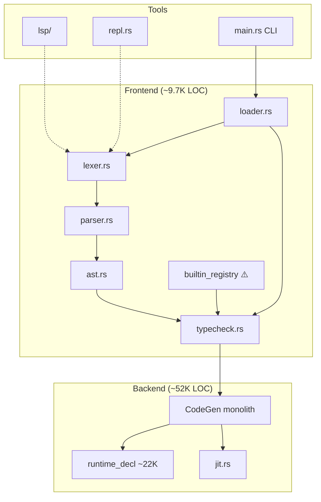

# Action 编译器：改进方向与自举可行性分析报告

> **文档性质**：只读调研报告，不含代码改动。  
> **调研日期**：2026-06-18  
> **代码基线**：`main` @ `bf6929e` 附近（P2/P4/P5 系列提交后）  
> **方法**：全库结构扫描 + 四路 SubAgent 深读（架构 / 前端 / 后端 / 自举）+ 本地度量

---

## 一、执行摘要

Action 是一门**功能已相当完整**的静态类型语言：可空类型、泛型、模式匹配、持久化集合、协程/流、LSP、JIT/AOT 等均已落地。Rust 编译器约 **66,376 行**，其中 **~78% 集中在 LLVM codegen 与 runtime IR**，前端（词法/语法/类型）仅 **~9,700 行**。

**核心结论：**

| 问题 | 建议 |
|------|------|
| 语言是否成熟到考虑自举？ | **前端层面可以开始规划**；**全栈自举（含 codegen）在可预见期内不现实** |
| 当前编译器是否「混乱」？ | **前端中度耦合、后端高度单体**；不是无序烂摊，而是**快速演进留下的结构性债务** |
| 直接推进自举，还是先优化结构？ | **强烈建议：先重构 + 稳定语义，再分阶段自举** |

**一句话策略：**

> 用 6–12 个月把 Rust 编译器整理成「清晰的前端边界 + 稳定的 Rust/LLVM 后端」，同时用 Action 重写**词法→语法→类型**；codegen 与 runtime **长期留在 Rust**，通过稳定 FFI/序列化 IR 对接。

---

## 二、项目现状量化

### 2.1 规模与分布

| 层级 | 约 LOC | 占比 | 文件数（量级） |
|------|--------|------|----------------|
| **LLVM runtime IR 生成** (`runtime_decl/`) | ~21,800 | 33% | 18 |
| **Codegen 调度** (expr/stmt/builtins/jit…) | ~30,000 | 45% | 35+ |
| **前端** (lexer/parser/ast/typecheck/loader) | ~9,700 | 15% | 8 |
| **LSP / REPL / 工具** | ~4,500 | 7% | 10+ |
| **合计** `src/**/*.rs` | **66,376** | 100% | 78 |

**最大的 10 个文件：**

```
5127  define_list_core.rs      ← List B-tree 核心 runtime
3763  define_list_tree.rs     ← Concat/insert/flatten
2841  parser.rs
2508  expr.rs
2114  builtins_call.rs        ← UFCS / 方法链 / RC 生命周期
2103  typecheck.rs
1901  define_hash_table.rs
1869  builtins_stdlib_datetime.rs
1795  lsp/handlers.rs
1716  lexer.rs
```

### 2.2 编译流水线

```
.at/.atom 源文件
    │
    ▼
ProjectConfig (atom.toml) ──可选──► 优化级别 / path deps
    │
    ▼
loader::load_program()          ← 主编排器
    ├─ Lexer::tokenize()
    ├─ Parser::parse_program()
    ├─ 注入 builtin 类型 + lib/math.at + lib/json.at
    ├─ resolve_imports() + transform_module_access()
    ├─ register_types() → TypeRegistry
    └─ TypeChecker::check()
    │
    ▼
(Program, TypeRegistry)
    │
    ▼
CodeGen::compile()              ← 两遍：声明 + 编译
    ├─ define_runtime()         ← 链接预构建 bitcode (~822KB)
    └─ expr/stmt/pattern/builtins_* → LLVM IR
    │
    ▼
JIT (MCJIT) / AOT (obj/exe) + libaction_host_rt.a (JSON/HTTP/线程)
```

### 2.3 质量门禁（已有）

| 资产 | 数量/状态 |
|------|-----------|
| Integration 测试 | **140** 项（语义权威） |
| 示例程序 | **234** 个 `.at` |
| AOT 基准 | **29** 项（`benchmark.sh --mode aot --opt 2`） |
| 单元测试 | lexer 36 / parser 27 / typecheck 23 |
| 文档 | README、BENCHMARK.md、doc/tutorial.md (~1700 行) |

### 2.4 Action 语言侧资产

| 路径 | 内容 | 对自举的意义 |
|------|------|--------------|
| `lib/math.at` | 15 行纯 Action 数学函数 | 证明 **纯 Action stdlib 可行** |
| `lib/json.at` | Action 包装 + Rust FFI | **FFI 薄层模式**可复用于 bootstrap |
| `stdlib/io.atom` | `external fun` 声明 | 读源文件所需 |
| `stdlib/http.atom` | HTTP 包装 | 与编译器无关 |

**仓库内无任何** `bootstrap` / `self-host` / 自举相关文档或 `.at` 编译器代码。

---

## 三、架构诊断：「混乱」在哪里？

### 3.1 总体判断

编译器**不是**缺乏设计的无序堆砌，而是经历了从**单文件 13k 行 monolith** 到**多 submodule 拆分**的过渡期。混乱感主要来自：

1. **体量极度倾斜**：后端是前端的 ~5.3 倍，维护心智负担在 runtime List/Map
2. **边界模糊**：前端、类型、builtin 元数据、codegen 之间缺少稳定 IR 层
3. **三套入口重复流水线**：`loader` / `repl` / `lsp` 各走一套 lex→parse→check
4. **双 runtime 架构**：LLVM bitcode runtime + Rust host staticlib，AOT/JIT 链接路径复杂

### 3.2 前端问题（自举首要相关）

#### （1）单体文件，缺少模块缝

| 文件 | LOC | 问题 |
|------|-----|------|
| `parser.rs` | 2,841 | 34 个 `parse_*`，Pratt 优先级表内嵌，无法增量移植 |
| `typecheck.rs` | 2,103 | 推断 + 检查 + 模式穷尽 + UFCS 全在一个 `match` 森林 |
| `lexer.rs` | 1,716 | 全文件缓冲 `Vec<char>`，与 parser 无显式接口 crate |

#### （2）Builtin 知识三重复

同一 builtin 的语义分散在：

- `codegen/builtin_registry.rs` — 类型签名 + LLVM dispatch 元数据
- `typecheck.rs` — `infer_expr_type_with_locals` 内 **20+ 硬编码函数名**
- `codegen/builtins_*.rs` — 实际 IR 生成

**自举时**：Action 版 typechecker 必须与三处保持同步，或**先抽取纯类型表**（`BuiltinTypeSig` 数据结构，与 LLVM 无关）。

#### （3）类型推断：非 HM，行为隐式

```text
未标注参数/返回值默认 Int
TypeVar 在 types_compatible 中总是兼容
try_infer_expr_type 静默 fallback 到 Int
```

这对用户友好，但对**自举移植**是陷阱：Action 重写的 checker 很难「猜对」所有隐式行为，必须依赖 140 项 integration 测试作 oracle。

#### （4）错误处理三套体系

| 层 | 类型 | 问题 |
|----|------|------|
| Lexer | `CompilerError` + `Span` | 可收集多个错误 |
| Parser | `ParseError` (line/col) | fail-fast；转 string 后丢失 byte offset |
| Typecheck | `CompilerError` | 完整 |
| `action run` | — | `Display` → 正则 re-parse 做 ariadne 高亮 |

LSP 使用 `parse_program_recover`，主流水线不用 — **恢复式解析与严格解析语义分叉**。

#### （5）typecheck 依赖 codegen 模块

```rust
// lib.rs — 刻意用 #[path] 打破循环依赖
#[path = "codegen/builtin_registry.rs"]
pub mod builtin_registry;
```

前端「理论上独立」，实际上**引用了带 LLVM dispatch 字段的 registry**。这是架构上最该先修的分界点。

### 3.3 后端问题（自举长期相关）

#### （1）无中间表示（IR）

```
AST + TypeRegistry ──直接──► inkwell Builder ──► LLVM Module
```

缺少 Typed IR / HIR / MIR 层，导致：

- 优化只能交给 LLVM TargetMachine（独立 PassManager 对 runtime IR 会 miscompile，见 `bench_for_nested` SIGSEGV）
- 无法在 Action 中「只重写后端一半」
- 每个新 `Expr` 变体需同时改 parser、typecheck、expr.rs、可能 builtins_*

#### （2）Monolithic `CodeGen` 状态

`CodeGen` 结构体 **~90 个字段**（scope、TCO、nullable smart-cast、generics…），35+ 文件 `impl CodeGen` 扩展。任何子模块都可读写全局状态 — **难以测试、难以拆分 crate**。

#### （3）Runtime IR 占 42% 后端

List B-tree + CoW + ConcatNode（`height == -1`）共 **~8,900 行** IR builder 代码。这是**算法正确性**与**性能**的核心，也是 `.cursor/rules` 中大量踩坑文档的来源：

- UFCS 方法链 double-eval → SIGSEGV
- ConcatNode 变异路径崩溃
- RC/CoW 不变量

**这些 bug 若未清零，自举链（用 Action 编译 Action 编译器）会指数级放大错误。**

#### （4）三层层叠的 stdlib

```
lib/math.at (自动加载)
stdlib/*.atom (手动 import)
builtins_stdlib_*.rs (codegen dispatch)
runtime_decl/define_*.rs (LLVM 实现)
```

同一能力（如字符串操作）可能穿越 **4 层**，新人难以理解「改一个 API 要动几处」。

### 3.4 工具链与 DX 缺口

| 领域 | 现状 | 影响 |
|------|------|------|
| `action fmt` | 刚加入 CLI，基于括号深度缩进 | 非 token-aware，无法作为自举前端的质量基线 |
| LSP | 功能较全 (~3600 LOC)，但与 loader 不同步 | 模块/import 在单 buffer 编辑时不完整 |
| 调试器 | 无 DAP | 自举开发效率低 |
| 包管理 | 仅 `atom.toml` path deps | 无法分发 bootstrap 编译器 |
| CI | 140 integration + 29 bench（部分 job 依赖 self-hosted runner） | 重构/自举需稳定 CI |

---

## 四、后续改进方向（优先级矩阵）

在已完成 P2（性能）、P4（测试/CI）、P5（fmt/check）基础上，建议按 **「稳定 → 结构化 → 自举准备 → 性能/生态」** 排序。

### 4.1 P0 — 语义稳定

| 项 | 说明 | 状态 |
|----|------|------|
| UFCS 方法链 RC | `builtins_call.rs` 只读方法禁止 double-eval | ✅ 持续回归 |
| ConcatNode 变异 | `push_subtree` ConcatNode 分支 | ✅ |
| AOT IR Pass | runtime 全模块 `default<O2>` 已禁用 | ✅ |
| 集成测试 | 140+ 项绿 | ✅ |

### 4.2 P1 — 架构重构（自举前置）

| # | 方向 | 状态 |
|---|------|------|
| 1 | `action-frontend` crate | ✅ |
| 2 | `builtin/registry.rs` 类型表 | ✅ |
| 3 | 统一诊断 `CompilerError` + Span | ✅ |
| 4 | HIR + JSON emit | ✅ |
| 5 | parser/typecheck 子模块拆分 | ✅ |
| 6 | LSP/REPL 共用 `FrontendSession` | ✅ |
| 7 | Runtime C ABI `include/action_rt.h` | ✅ |
| 8 | AST codegen 删除（R8） | ✅ |
| 9 | CLI / host-rt crate 化（R9） | ✅ |

### 4.3 P2 — 性能

| 方向 | 状态 |
|------|------|
| `insert_rec` 中间索引 insert | ✅ |
| `remove(0)` 快速路径 | ✅ |
| `list_get_cached` 推广至 reduce/iter | ✅ |
| ConcatNode balance / Map Robin-Hood / fused iter | ✅ |
| AOT LTO | ✅ |

### 4.4 P3 — 测试与质量

| 优先级 | 动作 | 状态 |
|--------|------|------|
| 高 | compile-error：import 循环/非法名、泛型、重载 | ✅ |
| 中 | Map CoW oracle（`test_map_cow_properties`） | ✅ |
| 中 | diagnostics JSON 测试 | ✅ |
| 低 | lib proptest 与 merge gate 解耦 | ✅（core CI `--skip proptest`；独立非阻塞 job） |

### 4.5 P4 — 开发者体验

| 工具 | 状态 |
|------|------|
| `action fmt` token-aware | ✅ |
| `action check --format json` | ✅ |
| `action check --explain` + JSON help 字段 | ✅ |
| VSCode 扩展 Marketplace | 待做 |

### 4.6 P5 — 生态

| 项 | 说明 |
|----|------|
| `atom.toml` registry / git deps | 分发 bootstrap 编译器必需 |
| 标准库分层规范 | 明确 `lib/` vs `stdlib/` vs Rust builtin 边界 |
| 语言规范文档 | 从 Rust 实现**反向提取**正式语义（自举 oracle） |

---

## 五、自举（Bootstrapping）深度分析

### 5.1 什么是「自举」对 Action 意味着

| 级别 | 定义 | 可行性 |
|------|------|--------|
| **L1 前端自举** | Action 实现 lex/parse/typecheck，Rust 做 codegen | **可行**，~10K LOC 等价 |
| **L2 IR 自举** | Action 前端 emit HIR/TIR，Rust 降低到 LLVM | **可行**，需先建 HIR |
| **L3 全栈自举** | Action 编译器完全用 Action 编写含 LLVM 发射 | **不可行**（语言无 LLVM 绑定） |
| **L4 运行时自举** | List/Map/RC runtime 也用 Action 重写 | **不划算**；应用 C/Rust 固定 runtime |

 realistic 目标是 **L1 → L2**，L3/L4 不在 2–3 年 horizon 内。

### 5.2 Action 语言对「写编译器」的支撑度

| 编译器需求 | Action 能力 | 缺口 |
|------------|-------------|------|
| 字符串扫描 | `String`, `charAt`, `substring` | 无 byte buffer；Unicode 需规范 |
| 数据结构 | `List`, `Map`, `Set`（持久化 CoW） | 大符号表性能差；缺可变 map |
| 代数类型 | struct/enum/when | ✅ 足够 |
| 递归 | 支持 | ✅ |
| 文件 I/O | `stdlib/io.atom` + FFI | ✅ 基本够 |
| 正则/lexer 工具 | 无 | 需手写或 FFI |
| 错误定位 | 可自建 `{line, col, msg}` struct | 无 span crate |
|  LLVM | 无 | **硬缺口** |
| 互操作 | `external fun` | ✅ 可接 Rust HIR 接收器 |

**结论**：写 **lexer + parser + AST + typechecker** 足够；写 **codegen** 必须 FFI 回 Rust 或 emit 文本 IR。

### 5.3 典型自举路径对比

#### 路径 A：直接全量自举（❌ 不推荐）

```
Rust 编译器 ──► 用 Action 重写全部 66K LOC ──► 自举
```

| 风险 | |
|------|--|
| LLVM 无绑定 | 必须在 Action 中重写 inkwell → 等于重写后端 |
| 无 HIR | 前端 AST 直接对接 Rust codegen，接口不稳定 |
| 已知 bug | ConcatNode/UFCS 进入 bootstrap 链 |
| 测试 oracle 不足 | 泛型/扩展方法覆盖薄 |

#### 路径 B：先重构再分阶段自举（✅ 推荐）

```
Phase 0: 稳定语义 + 140 tests 全绿
Phase 1: 架构重构（frontend crate + BuiltinTypeSig + 统一诊断）
Phase 2: 定义 HIR + JSON/bincode 序列化
Phase 3: Action 重写 lexer（~1.7K LOC 等价）→ 对比测试
Phase 4: Action 重写 parser（最大块，按语法类别增量）
Phase 5: Action 重写 typecheck（先显式类型子集）
Phase 6: Action 前端 + Rust codegen 通过 HIR 对接
Phase 7: （可选）逐步扩大 Action 前端覆盖，Rust 前端退役
```

**Rust codegen + runtime 永久保留**，与 Go/Rust 早期 bootstrap 策略一致。

#### 路径 C：TCC/SubC 式小子集（⚠️ 备选）

先写只能编译「Action 子集」的 mini 编译器（Action 实现），再逐步扩大。

**阻塞**：需形式化定义 subset；当前语言特性交叉太多（nullable × UFCS × 泛型 × 模式）。

### 5.4 若现在直接自举会遇到的 concrete 问题

1. **`builtin_registry` 含 LLVM 字段** — Action typechecker 无法干净移植  
2. **`loader.rs` 798 行** — import 图、循环检测、模块名变换，filesystem 逻辑复杂  
3. **Parser 2841 行单文件** — 无测试驱动的增量 port 接口  
4. **持久化 Map 做符号表** — O(log n) 每次 insert，编译大文件性能未知  
5. **无语言规范** — Rust 即 spec，Action 重写只能靠 integration 测试对齐  
6. **build.rs bitcode 引导** — 自举 compiler 仍需预编译 `action_runtime.bc`  
7. **JIT symbol mapping** — 100+ 符号；bootstrap 应走 AOT-only 路径  

### 5.5 自举准备度评分

| 维度 | 分数 (1–5) | 说明 |
|------|-----------|------|
| 语言表达力 | 4 | 写前端足够 |
| 编译器模块化 | 2 | 单体文件 + 无 HIR |
| 语义稳定性 | 3 | 140 tests 强，但有已知 RC/List 坑 |
| 测试 oracle | 4 | integration 权威 |
| 文档/规范 | 2 | 无 formal spec |
| 工具链 | 3 | LSP/REPL 有，debugger 无 |
| 生态/分发 | 1 | 无 registry |
| **综合自举准备度** | **2.5 / 5** | 需 6–12 个月重构 |

---

## 六、核心决策：先自举 vs 先重构

### 6.1 决策矩阵

| 评估标准 | 直接推进自举 | 先优化结构再自举 |
|----------|-------------|-----------------|
| **交付风险** | 极高 — 双份逻辑漂移 | 低 — 单份 Rust 源逐步替换 |
| **时间到首个里程碑** | 看似快（写 `.at` lexer） | 慢 2–3 月（拆 crate） |
| **时间到可用自举编译器** | 更长（接口反复改） | 更短（HIR 冻结后 port 稳定） |
| **团队心智负担** | 同时维护 Rust + Action 两套前端 | 先整理 Rust，再按模块替换 |
| **bug 放大效应** | List/UFCS bug 进入自举链 | 先清零再 port |
| **与性能优化关系** | 竞争同一代码区域 | 重构后可并行（frontend / runtime 分离） |

### 6.2 明确建议

> **不要直接推进全栈自举。**
> **不要等「完美重构」才开始自举。**
> **正确策略：并行但有序 —— 重构打地基，自举从 lexer 试点开始。**

推荐时间线：

```
2026 Q3–Q4   P0 稳定 + P1 架构重构（frontend crate, BuiltinTypeSig, 诊断统一）
2026 Q4      定义 HIR schema + 冻结 bootstrap 语言子集规范
2027 Q1      Action 实现 lexer，Rust 对照测试（golden token files）
2027 Q2      Action 实现 parser 子集（表达式 + 函数声明）
2027 Q3–Q4   Action 实现 typecheck 子集 → HIR emit → Rust codegen
2028+        扩大子集；Rust 前端逐模块退役
             codegen/runtime 留 Rust（ indefinitely ）
```

### 6.3 Bootstrap 语言子集（建议首版冻结）

首版 Action-in-Action 编译器**自身源码只允许使用**：

| 允许 | 禁止（首版） |
|------|-------------|
| `val` / `var` / `fun` | 协程 `Task`/`Stream` |
| 基本类型 + struct/enum | `lazy val` |
| `when` 简单模式 | 扩展方法 |
| `List`/`Map`/`String` | 函数重载 |
| `for` / `while` | 复杂 UFCS 链 |
| 显式类型标注（无隐式 Int 默认） | FFI（除 host I/O hook） |
| 单文件，无 import | 模块系统 |

子集随自举阶段逐步扩大，与 `tests/integration.rs` 子集同步加测试。

---

## 七、推荐路线图（汇总）

### 7.1 三轨并行

```
┌─────────────────────────────────────────────────────────────┐
│ 轨道 A：语义 & 质量（P0/P4）                                  │
│   140 integration 永绿 + RC/List property tests + CI 稳定    │
├─────────────────────────────────────────────────────────────┤
│ 轨道 B：架构重构（P1，自举前置）                              │
│   frontend crate │ BuiltinTypeSig │ HIR │ 诊断统一 │ LSP 合一  │
├─────────────────────────────────────────────────────────────┤
│ 轨道 C：自举试点（P1 后期启动）                               │
│   lexer.at → parser.at → typecheck.at → HIR → Rust codegen   │
└─────────────────────────────────────────────────────────────┘
         ↑ 轨道 B 完成 HIR 冻结后，轨道 C 全面加速
```

### 7.2 关键里程碑与验收标准

| 里程碑 | 验收 |
|--------|------|
| M1 语义冻结 | 140 integration + 29 AOT bench 全绿；UFCS/ConcatNode 有回归测试 |
| M2 Frontend crate | `cargo build -p action-frontend` 无 codegen 依赖 |
| M3 HIR v0 | JSON schema + round-trip 测试；Rust codegen 从 HIR 编译 hello.at |
| M4 Action lexer | token 输出与 Rust lexer 100% 一致（golden files） |
| M5 Action parser 子集 | 解析 bootstrap 子集源码 → HIR |
| M6 自举 Alpha | Action 写的 lexer+parser+checker 编译自身源码（经 Rust codegen） |

### 7.3 不建议做的事

- ❌ 在 `define_list_core.rs` 未稳定前用 Action 重写 List runtime  
- ❌ 对完整 runtime IR 跑 LLVM PassManager `default<O2>`  
- ❌ 同时重写 LSP（3600 LOC）与编译器前端  
- ❌ 无 HIR 直接让 Action AST 对接 inkwell  
- ❌ 跳过语言子集规范，直接 port 完整 `parser.rs`  

---

## 八、风险 register

| 风险 | 概率 | 影响 | 缓解 |
|------|------|------|------|
| 双前端逻辑漂移 | 高 | 自举 compiler 编译结果不一致 | HIR 作为单一真相；golden tests |
| List/RC 语义 bug | 中 | 自举链崩溃 | M1 前 property tests |
| 持久化 Map 性能 | 中 | 大项目编译慢 | bootstrap 子集用显式数据结构；或允许 `var` + 可变 buffer FFI |
| CI runner 不稳定 | 高 | 重构回归难发现 | GitHub hosted fallback job |
| 团队规模小 | 中 | 三轨并行人力不足 | 严格优先级：M1 > M2 > M3 > M4 |
| LLVM 版本升级 | 低 | inkwell 绑定破坏 | 锁定 LLVM 21，计划升级窗口 |

---

## 九、附录

### A. 模块依赖简图



### B. 与主流编译器 bootstrap 策略对照

| 编译器 | 策略 | 对 Action 的启示 |
|--------|------|------------------|
| Go | C bootstrap → Go 重写 frontend+backend | 先固定 runtime ABI |
| Rust | LLVM 后端不 bootstrapped | **后端留 Rust/LLVM** |
| Scala | Java 写 → Scala 重写 | 分阶段、子集递增 |
| OCaml | OCaml 重写 OCaml | 需语言已足够表达自身 |
| Zig | C bootstrap → Zig 重写 | 小子集起步 |

Action 最接近 **Rust + Scala 混合策略**：LLVM 后端保留，前端分阶段用 Action 重写。

### C. 关键文件索引

| 路径 | 自举相关度 |
|------|-----------|
| `src/lexer.rs` | ★★★ 首个 port 目标 |
| `src/parser.rs` | ★★★ 最大 port 块 |
| `src/typecheck.rs` | ★★★ 语义核心 |
| `src/types.rs` | ★★☆ 可独立 port |
| `src/loader.rs` | ★★☆ 后期 port |
| `src/codegen/builtin_registry.rs` | ★★★ 必须先拆分 |
| `src/codegen/expr.rs` | ★☆☆ 留 Rust |
| `src/codegen/runtime_decl/*` | ☆☆☆ 不 port |
| `lib/json.at` | ★★☆ FFI 模式参考 |
| `tests/integration.rs` | ★★★ oracle |

---

## 十、最终结论

1. **Action 语言已具备写编译器前端的表达力**，但编译器工程尚未为此做好准备。  
2. **「混乱」的本质**是缺少 frontend/backend 清晰边界、HIR 层、以及 builtin 元数据重复 — 可通过 6–9 个月重构系统性解决。  
3. **自举是正确长期方向**，但应为 **「前端自举 + Rust/LLVM 后端常驻」**，而非全栈重写。  
4. **立即行动**：稳定语义 → 拆 `frontend` crate → 定义 HIR → Action 重写 lexer 试点。  
5. **不要立即行动**：全量 port parser/typecheck、重写 runtime IR、在 PassManager 未隔离 runtime 时强推 AOT LTO。

---

*本报告由代码库全量扫描与 SubAgent 深读生成，供架构决策参考。如需针对某一 Phase 展开实施计划，可单独开 doc。*
